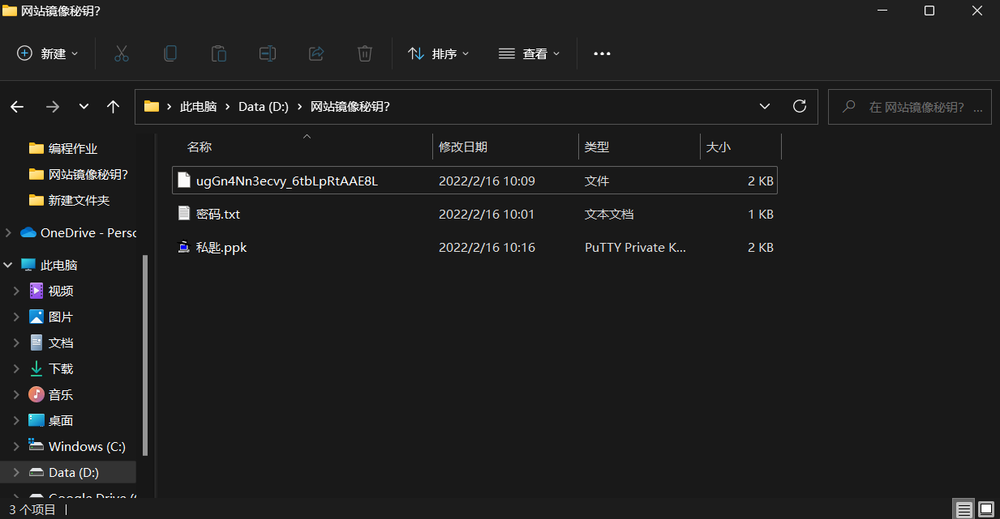
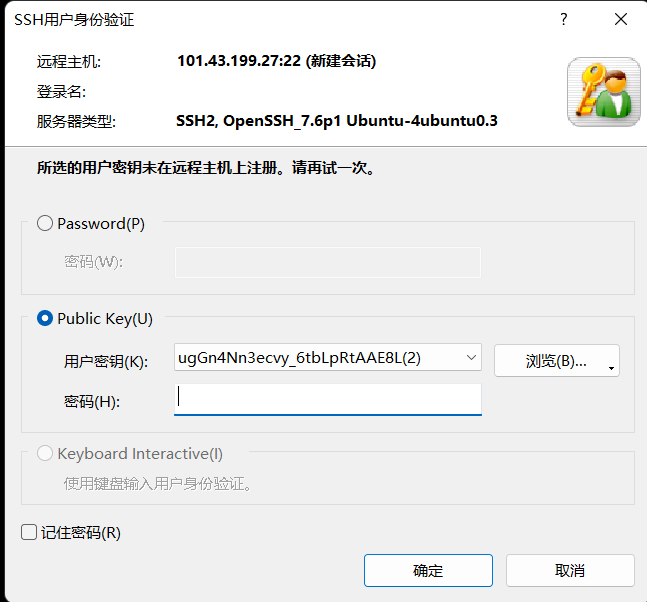
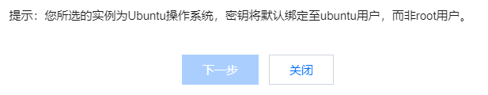

我使用腾讯云轻量应用服务器安装了ubuntu 18.0.4镜像，然后创建了一个秘钥，得到了以下文件


其中，第一个是通过腾讯云服务器控制台得到的秘钥文件，第二个是该服务器某密码，第三个是通过putty得到的私钥文件。  
腾讯云服务器安装ubuntu后会默认创建一个ubuntu用户，然后以该用户名登录，同时禁止使用root账户登录。我通过xshell进行连接，在进行一些操作时显示权限不够，所以需要用sudo执行命令，但是每次都需要输入sudo不太方便，于是我就想通过秘钥来登录该服务器的root账户。  
1、首先给root账户指定一个密码  
```
sudo passwd root
```
这时会要求输入密码并且重复密码，完成之后会出现`passwd: password updated successfully`这行代码,说明成功设置密码。  
2、然后修改SSH设置
```
sudo vi /etc/ssh/sshd_config
```
3、找到`PermitRootLogin`，将其后面更改为yes   
4、保存重启ssh服务
```
sudo service ssh restart
```
进行完这些操作后我就使用xshell登录该服务器的root账户，但是显示    

  

然后我使用`find -name authorized_keys`命令发现root用户和ubuntu用户分别对应一个 authorized_keys 文件。ubuntu用户加载了正确的ssh公钥，而root用户下的authorized_keys文件内容则为空。同时，腾讯云服务器绑定秘钥的界面有这句话  
  
这也说明了绑定秘钥时只把公钥添加到了ubuntu账户而非root账户，自然就可以理解为什么xshell提示该用户秘钥在远程主机未注册了。  
那么接下来就是  
1、打开 ubuntu 用户的 authorized_keys 文件所在目录
```
cd /home/ubuntu/.ssh/
```
2、拷贝 authorized_keys 文件覆盖root用户的 authorized_keys 文件
```
cp -i authorized_keys /root/.ssh/
```
3、重启SSH服务
```
sudo service ssh restart
```
至此大功告成  


在这次查找解决方案时，深感csdn社区大量文章互相抄袭却没有解决问题。